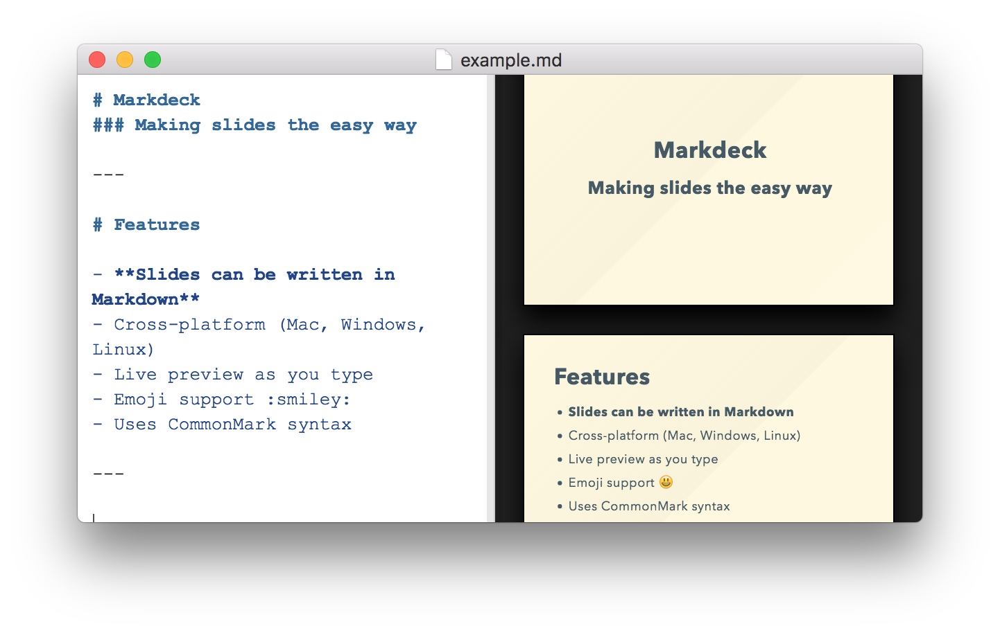

# Markdeck



> Live presentation creation using Markdown

## For Developers

### Install

```bash
npm install
npm run dev
```

### Create Release

```bash
npm run package
```

To package apps for all platforms:

```bash
$ npm run package-all
```

### DevTools

#### Toggle Chrome DevTools

- OS X: <kbd>Cmd</kbd> <kbd>Alt</kbd> <kbd>I</kbd> or <kbd>F12</kbd>
- Linux: <kbd>Ctrl</kbd> <kbd>Shift</kbd> <kbd>I</kbd> or <kbd>F12</kbd>
- Windows: <kbd>Ctrl</kbd> <kbd>Shift</kbd> <kbd>I</kbd> or <kbd>F12</kbd>

*See [electron-debug](https://github.com/sindresorhus/electron-debug) for more information.*


```bash
$ npm run package
```

To package apps for all platforms:

```bash
$ npm run package-all
```

To package apps with options:

```bash
$ npm run package -- --[option]
```

## Maintainers

- [Daniel Olfelt](https://github.com/dolfelt)


## License
MIT © [Daniel Olfelt](https://github.com/dolfelt)
